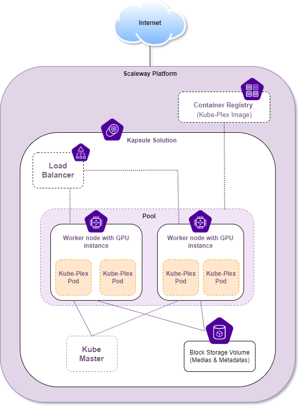

# SCW-Plex-Terraform
:key: Ce repo fournit le fichier Terraform pour déployer sur Scaleway l'infrastructure illustrée ci-dessous : 



## Prérequis
Installer la CLI Scaleway
```bash
# Récupération de l'utilitaire
sudo curl -o /usr/local/bin/scw -L "https://github.com/scaleway/scaleway-cli/releases/download/v2.4.0/scw-2.4.0-linux-x86_64"
# Ajout des droits d'éxécution
sudo chmod +x /usr/local/bin/scw
# Initialisation de la CLI (il faudra rentrer vos indentifiant Scaleway)
scw init
```

## Kickstart

```BASH
# Clonez repo
git clone https://github.com/Kev1venteur/SCW-Plex-Terraform.git && cd SCW-Plex-Terraform

# Lancez l'initialisation de Terraform
terraform init
# Vérifiez la sythaxe du fichier main
terraform plan
# Appliquez la conf chez Scaleway
terraform apply
# (Optionnel) Détruisez ce que vous venez de créer
terraform destroy
``` 

## Debug

#### Augmenter le niveau de log de Terraform

Avant de lancer Terraform définissez la variable d'environnement 'TF_LOG'.

```bash
export TF_LOG=DEBUG
```

